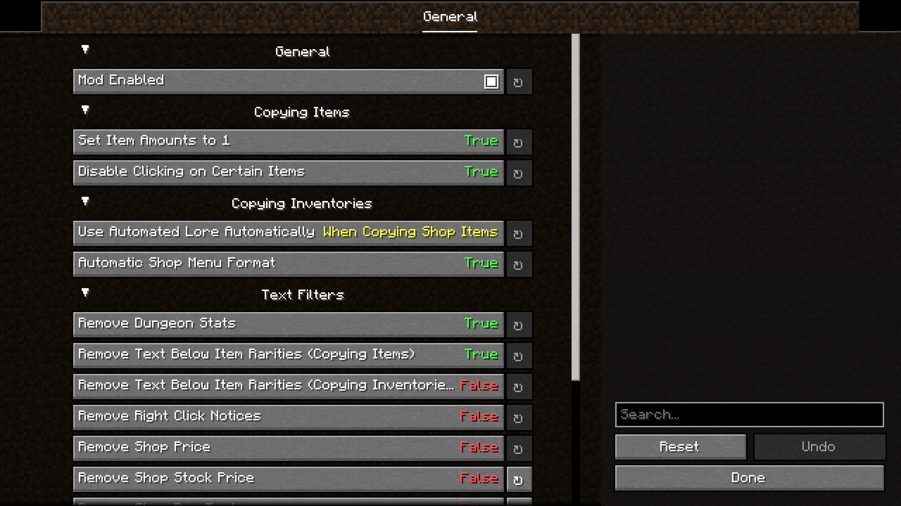

# WikiWriter
WikiWriter is a 1.20.4 Fabric (previously 1.8.9 Forge) mod that converts Hypixel SkyBlock items, menus, shops, and recipe trees into MediaWiki syntax for use on the official [Hypixel Wiki](https://wiki.hypixel.net).

----

## Item Templates
Items can be converted into [Item Templates](https://wiki.hypixel.net/Category:Item_UI_Templates), which can be used on other pages. Here is an example of the [Grappling Hook](https://wiki.hypixel.net/Grappling_Hook):


##### [Item Template:](https://wiki.hypixel.net/Category:Item_UI_Templates)
```
<noinclude>[[Category:Item UI Templates]]</noinclude><includeonly>
mc,uncommon,fishing_rod:Grappling Hook ,1,&7Travel around in style using\n&7this Grappling Hook.\n&82 Second Cooldown\n\n&a''' UNCOMMON'''
</includeonly>
```

## Recipes and Recipe Trees
Recipes can be copied into [Inventory Templates](https://wiki.hypixel.net/Template:Craft_Item) and [Recipe Trees](https://wiki.hypixel.net/Template:CollapsibleTree). Here is an example using an [Enchanted Eye of Ender](https://wiki.hypixel.net/Enchanted_Eye_Of_Ender).


###### [Recipe Template:](https://wiki.hypixel.net/Template:Craft_Item)
```
{{Craft Item
|in2={{Item_blaze_powder}},16
|in4={{Item_blaze_powder}},16
|in5={{Item_enchanted_ender_pearl}},16
|in6={{Item_blaze_powder}},16
|in8={{Item_blaze_powder}},16
|out={{Item_enchanted_eye_of_ender}}
}}
<noinclude>[[Category:Recipe Templates]]</noinclude>
```
###### [Collapsible Tree Template:](https://wiki.hypixel.net/Template:CollapsibleTree)
```
{{CollapsibleTree|{{{1|Item}}}
|itemimage = {{formatnum:{{{2|1|}}}}} [[File:SkyBlock_items_enchanted_eye_of_ender.gif|20px|link=Enchanted Eye of Ender]]
|itemname = [[Enchanted Eye of Ender]]

|resources = 
{{CollapsibleTree/Base|{{formatnum:{{#expr:64 * {{{2|1}}}}}}} {{Item/BLAZE_POWDER|is=20}}}}
{{CollapsibleTree/Item/enchanted_ender_pearl|Item|{{#expr:16 * {{{2|1}}}}}}}
}}
<noinclude>[[Category:CollapsibleTree]]</noinclude>
```

## Shops
Similar to recipes, shop inventories can be converted into [Inventory Templates](https://wiki.hypixel.net/Category:NPC_UI_Templates) using a [similar style](https://wiki.hypixel.net/Template:Merchant) of syntax.


###### [Merchant Template:](https://wiki.hypixel.net/Template:Merchant)
```
{{Merchant
|name=Ulyn
|item1={{Item_mycel}}\n\n&7Cost\n&620 Coins
|item2={{Item_blaze_rod}}\n\n&7Cost\n&650 Coins
|item3={{Item_magma_cream}}\n\n&7Cost\n&620 Coins
|item4={{Item_quartz}}\n\n&7Cost\n&650 Coins
|item5={{Item_nether_stalk}}\n\n&7Cost\n&625 Coins
|item6={{Item_ghast_tear}}\n\n&7Cost\n&6200 Coins
}}
<noinclude>[[Category:NPC UI Templates]]</noinclude>
```

## Other Inventories
Inventories that are not categorized as shops or recipes use the standard [Inventory Template](https://wiki.hypixel.net/Template:Inventory), though the syntax is often messier as a result.


###### [Inventory Template:](https://wiki.hypixel.net/Template:Inventory)
```
{{Inventory
|name=Select Tier
|rows=4
|A1=?mc,,black_stained_glass_pane
|A2=?mc,,black_stained_glass_pane
|A3=?mc,,black_stained_glass_pane
|A4=?mc,,black_stained_glass_pane
|A5=?mc,,black_stained_glass_pane
|A6=?mc,,black_stained_glass_pane
|A7=?mc,,black_stained_glass_pane
|A8=?mc,,black_stained_glass_pane
|A9=?mc,,black_stained_glass_pane
|B1=?mc,,black_stained_glass_pane
|B2=?mc,,black_stained_glass_pane
|B3=!sb,,kuudra_tier_key:&bKuudra &8- &eBasic Tier,1,&7Party size: &92-4\n \n&7Boss: &cKuudra &a✔\n&8Lava Kraken\n&7Overgrown lava Kraken. The more Sulphur it\n&7consumes the stronger it becomes.\n \n&7Requirements:\n&a✓ Have Elle take you to\n&aKuudra!\n\n&eClick to queue!
|B4=!sb,,kuudra_hot_tier_key:&bKuudra &8- &eHot Tier,1,&7Party size: &92-4\n \n&7Boss: &cKuudra &a✔\n&8Lava Kraken\n&7Overgrown lava Kraken. The more Sulphur it\n&7consumes the stronger it becomes.\n \n&7Requirements:\n&a✓ Complete the main quest!\n&a✓ 1<nowiki>,</nowiki>000 Reputation in any\n&afaction.\n&a✓ Beat the previous tier.\n\n&eClick to queue!
|B5=!sb,,kuudra_burning_tier_key:&bKuudra &8- &eBurning Tier,1,&7Party size: &92-4\n \n&7Boss: &cKuudra &a✔\n&8Lava Kraken\n&7Overgrown lava Kraken. The more Sulphur it\n&7consumes the stronger it becomes.\n \n&7Requirements:\n&a✓ 3<nowiki>,</nowiki>000 Reputation in any\n&afaction.\n&a✓ Beat the previous tier.\n\n&eClick to queue!
|B6=!sb,,kuudra_fiery_tier_key:&bKuudra &8- &eFiery Tier,1,&7Party size: &92-4\n \n&7Boss: &cKuudra &a✔\n&8Lava Kraken\n&7Overgrown lava Kraken. The more Sulphur it\n&7consumes the stronger it becomes.\n \n&7Requirements:\n&a✓ 7<nowiki>,</nowiki>000 Reputation in any\n&afaction.\n&a✓ Beat the previous tier.\n\n&eClick to queue!
|B7=!sb,,kuudra_infernal_tier_key:&bKuudra &8- &eInfernal Tier,1,&7Party size: &92-4\n \n&7Boss: &cKuudra &a✔\n&8Lava Kraken\n&7Overgrown lava Kraken. The more Sulphur it\n&7consumes the stronger it becomes.\n \n&7Requirements:\n&a✓ 12<nowiki>,</nowiki>000 Reputation in any\n&afaction.\n&a✓ Beat the previous tier.\n\n&eClick to queue!
|B8=?mc,,black_stained_glass_pane
|B9=?mc,,black_stained_glass_pane
|C1=?mc,,black_stained_glass_pane
|C2=?mc,,black_stained_glass_pane
|C3=?mc,,black_stained_glass_pane
|C4=?mc,,black_stained_glass_pane
|C5=?mc,,black_stained_glass_pane
|C6=?mc,,black_stained_glass_pane
|C7=?mc,,black_stained_glass_pane
|C8=?mc,,black_stained_glass_pane
|C9=?mc,,black_stained_glass_pane
|D1=?mc,,black_stained_glass_pane
|D2=?mc,,black_stained_glass_pane
|D3=?mc,,black_stained_glass_pane
|D4=!mc,uncommon,block_of_redstone:Find a Party,1,&7Use the Party Finder to join a\n&7party to fight the Kuudra.\n\n&eClick to browse!
|D5=!mc,special,barrier:Close
|D6=?mc,,black_stained_glass_pane
|D7=?mc,,black_stained_glass_pane
|D8=?mc,,black_stained_glass_pane
|D9=?mc,,black_stained_glass_pane
}}
```

## Lore Filters and Configuration
WikiWriter contains a variety of options, many of which control what lore is shown or hidden in certain scenarios. This menu can be accessed with the `/wikiwriter` or `/ww` commands.

